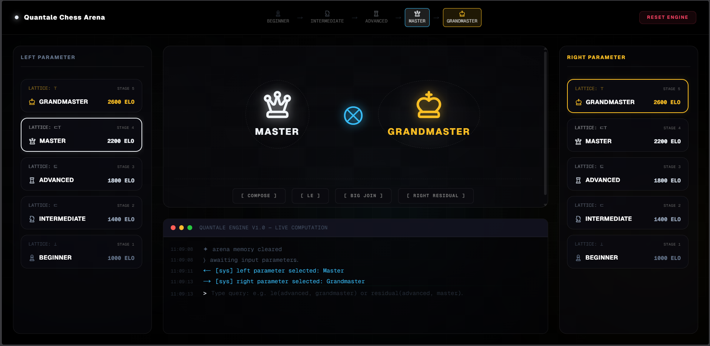

<div align="center">
  
  <br><br>
  <h1>Quantale Lab</h1>
  <em>A formal algebraic engine modeling chess skill progression.</em>
  <br><br>

  [](client/)
  [](server/)
  [](server/)
  [](client/)
</div>

<hr>

## Overview

**Quantale Lab** is an interactive educational engine designed to map advanced algebraic structures—Posets, Lattices, and Residuated Quantales—directly onto chess skill hierarchies. By evaluating exact capability bounds, interaction networks, and residual computations through formal tensor mathematics, it provides a rigorous foundation for capability-constrained systems.

The platform is built with a decoupled architecture. Both domains are comprehensively documented in their respective workspaces:

- **[The Interactive Arena (Client)](./client/README.md)**: A high-performance, aesthetically driven Next.js application that visualizes the engine's operations, providing an interactive arena and comprehensive markdown documentation.
- **[The Mathematical Engine (Server)](./server/README.md)**: A purely formal Python/FastAPI backend strictly evaluating tensor operations, complete lattices, and Galois connections.

---

## Core Mathematical Axioms

The backend engine programmatically validates the following abstract algebraic properties within the context of chess progression:

1. **Idempotent Monoids:** Tensor composition `(⊗)` handling interaction rules, with Grandmaster acting as the identity.
2. **Complete Lattices:** Computing Supremum (`Join`) and Infimum (`Meet`) capabilities to resolve capability ceilings and floors.
3. **Distributivity:** Proving that tensor composition correctly distributes over arbitrary joins.
4. **Residuation:** Computing right and left residuals `(→)` to determine the exact requirements bridging capability gaps (Galois connections).

---

## Local Development

To run the full application locally, you will need to start both the backend engine and the frontend interface concurrently.

### 1. Start the Mathematical Engine
The engine runs on Python/FastAPI. We recommend using `uv` for lightning-fast dependency management.

```bash
cd server
uv run python app/main.py
```
> *For detailed engine documentation, mathematical proofs, and API schemas, please read the **[Server Documentation](./server/README.md)**.*

### 2. Start the Interactive Interface
The frontend is built on Next.js 15 (App Router) and TailwindCSS.

```bash
cd client
npm install
npm run dev
```
> *For UI component architecture, routing structures, and deployment instructions, please read the **[Client Documentation](./client/README.md)**.*

---

## Project Architecture

```text
quantale-lab/
├── client/                     # Next.js Interactive Arena
│   ├── src/app/                # App Router Pages
│   ├── src/components/         # Reusable React UI Components
│   ├── src/lib/                # API Engine Clients
│   └── README.md               # Frontend Context
│
├── server/                     # Python Mathematical Engine
│   ├── app/
│   │   ├── api/                # Route definitions
│   │   ├── core/               # Pure Mathematical Logic
│   │   └── main.py             # Server Entry Point
│   └── README.md               # Backend Context
│
└── README.md                   # Root Context
```
